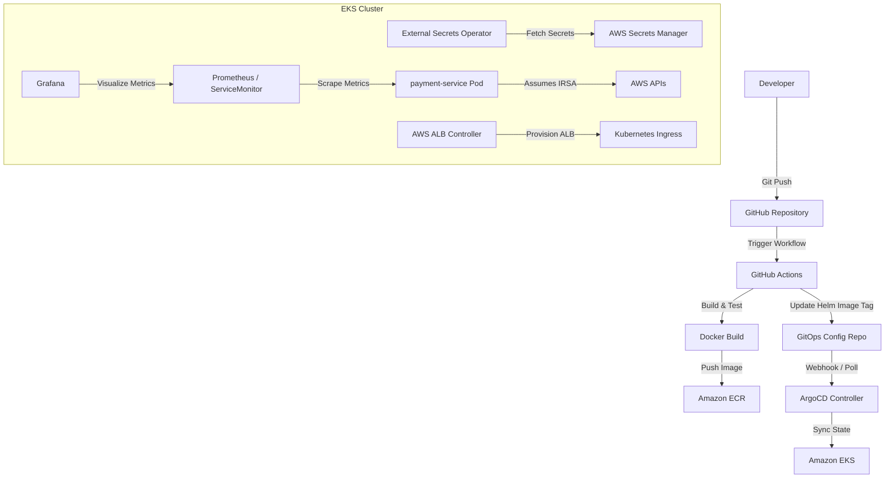

# Exercise 1: EKS Application Deployment via GitOps

This exercise details the complete GitOps architecture and deployment strategy for the new microservice `payment-service` to an AWS EKS cluster.

## Deployment Architecture

The following diagram illustrates the end-to-end GitOps delivery pipeline:



---

## 1. Helm Chart Structure
The `payment-service` is packaged using a standard Helm chart structure:
```text
payment-service-chart/
├── Chart.yaml
├── values.yaml
└── templates/
    ├── deployment.yaml
    ├── service.yaml
    ├── ingress.yaml
    ├── serviceaccount.yaml
    ├── externalsecret.yaml
    └── servicemonitor.yaml
```

### Values Configuration (`values.yaml` snippet)
```yaml
replicaCount: 3

image:
  repository: 123456789012.dkr.ecr.ap-south-1.amazonaws.com/payment-service
  pullPolicy: IfNotPresent
  tag: "v1.0.0"  # Updated dynamically by CI pipeline

serviceAccount:
  create: true
  name: payment-service-sa
  annotations:
    eks.amazonaws.com/role-arn: arn:aws:iam::123456789012:role/payment-service-irsa-role

ingress:
  enabled: true
  className: alb
  annotations:
    alb.ingress.kubernetes.io/scheme: internet-facing
    alb.ingress.kubernetes.io/target-type: ip
    alb.ingress.kubernetes.io/listen-ports: '[{"HTTP": 80}, {"HTTPS": 443}]'
    alb.ingress.kubernetes.io/ssl-redirect: '443'
    alb.ingress.kubernetes.io/certificate-arn: arn:aws:acm:ap-south-1:123456789012:certificate/abc-123-xyz
  hosts:
    - host: payment.example.com
      paths:
        - path: /
          pathType: Prefix

serviceMonitor:
  enabled: true
  interval: 15s
  path: /metrics
  port: metrics
```

---

## 2. ArgoCD Application Manifest
To implement GitOps with **Auto-Sync** and **Self-Healing**, the ArgoCD Application is defined as follows:

```yaml
apiVersion: argoproj.io/v1alpha1
kind: Application
metadata:
  name: payment-service
  namespace: argocd
spec:
  project: default
  source:
    repoURL: 'https://github.com/my-org/gitops-infra.git'
    targetRevision: HEAD
    path: charts/payment-service
    helm:
      valueFiles:
        - values.yaml
  destination:
    server: 'https://kubernetes.default.svc'
    namespace: production
  syncPolicy:
    automated:
      prune: true        # Delete resources no longer in Git
      selfHeal: true     # Override manual cluster changes back to Git state
    syncOptions:
      - CreateNamespace=true
      - ApplyOutOfSyncOnly=true
```

---

## 3. Secret Management (AWS Secrets Manager & ESO)
Rather than checking sensitive keys into Git, secrets are stored in AWS Secrets Manager and synced into Kubernetes Secrets using the **External Secrets Operator (ESO)**.

### Step 1: SecretStore Definition (pointing to AWS Secrets Manager)
```yaml
apiVersion: external-secrets.io/v1beta1
kind: SecretStore
metadata:
  name: aws-secretsmanager
  namespace: production
spec:
  provider:
    aws:
      service: SecretsManager
      region: ap-south-1
      auth:
        jwt:
          serviceAccountRef:
            name: payment-service-sa  # Uses IRSA to fetch secrets
```

### Step 2: ExternalSecret Definition
```yaml
apiVersion: external-secrets.io/v1beta1
kind: ExternalSecret
metadata:
  name: payment-db-secret
  namespace: production
spec:
  refreshInterval: 1h
  secretStoreRef:
    name: aws-secretsmanager
    kind: SecretStore
  target:
    name: payment-k8s-secret  # Name of the created K8s Secret
    creationPolicy: Owner
  data:
    - secretKey: DB_PASSWORD
      remoteRef:
        key: production/payment-service
        property: db_password
```

---

## 4. IAM Roles for Service Accounts (IRSA)
To enforce the principle of least privilege, the pods running `payment-service` assume a specific IAM Role.

### IAM Policy (`payment-service-policy.json`)
```json
{
  "Version": "2012-10-17",
  "Statement": [
    {
      "Effect": "Allow",
      "Action": [
        "secretsmanager:GetSecretValue",
        "secretsmanager:DescribeSecret"
      ],
      "Resource": "arn:aws:secretsmanager:ap-south-1:123456789012:secret:production/payment-service-*"
    }
  ]
}
```

### Trust Relationship (Trusts the OIDC Provider of the EKS Cluster)
```json
{
  "Version": "2012-10-17",
  "Statement": [
    {
      "Effect": "Allow",
      "Principal": {
        "Federated": "arn:aws:iam::123456789012:oidc-provider/oidc.eks.ap-south-1.amazonaws.com/id/EXAMPLETOCKEN"
      },
      "Action": "sts:AssumeRoleWithWebIdentity",
      "Condition": {
        "StringEquals": {
          "oidc.eks.ap-south-1.amazonaws.com/id/EXAMPLETOCKEN:sub": "system:serviceaccount:production:payment-service-sa"
        }
      }
    }
  ]
}
```

---

## 5. Ingress Configuration (ALB)
The service is exposed using the **AWS Load Balancer Controller** with the `ip` target-type, routing traffic directly to Pod IPs.

```yaml
apiVersion: networking.k8s.io/v1
kind: Ingress
metadata:
  name: payment-ingress
  namespace: production
  annotations:
    kubernetes.io/ingress.class: alb
    alb.ingress.kubernetes.io/scheme: internet-facing
    alb.ingress.kubernetes.io/target-type: ip
    alb.ingress.kubernetes.io/listen-ports: '[{"HTTP": 80}, {"HTTPS": 443}]'
    alb.ingress.kubernetes.io/ssl-redirect: '443'
    alb.ingress.kubernetes.io/certificate-arn: arn:aws:acm:ap-south-1:123456789012:certificate/abc-123-xyz
    alb.ingress.kubernetes.io/healthcheck-path: /healthz
    alb.ingress.kubernetes.io/healthcheck-interval-seconds: '15'
spec:
  rules:
    - host: payment.example.com
      http:
        paths:
          - path: /
            pathType: Prefix
            backend:
              service:
                name: payment-service
                port:
                  number: 8080
```

---

## 6. Observability
Metrics are exported in Prometheus format via a `/metrics` HTTP endpoint.

### ServiceMonitor Definition
```yaml
apiVersion: monitoring.coreos.com/v1
kind: ServiceMonitor
metadata:
  name: payment-service-monitor
  namespace: production
  labels:
    release: prometheus-stack  # Must match the Prometheus operator selector
spec:
  selector:
    matchLabels:
      app: payment-service
  endpoints:
    - port: metrics
      path: /metrics
      interval: 15s
```

The scraped metrics are visualized in Grafana using a dashboard displaying:
- **Request Rate** (queries per second via `rate(http_requests_total[5m])`)
- **Error Rate** (HTTP 5xx rate via `rate(http_requests_total{status=~"5.."}[5m])`)
- **Latency Percentiles** (p95 latency via `histogram_quantile(0.95, sum(rate(http_request_duration_seconds_bucket[5m])) by (le))`)
- **Resource Utilization** (CPU/Memory usage relative to limit thresholds)
