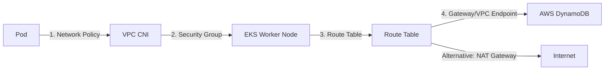

# Exercise 8: Egress Restriction Incident Analysis

This document details the diagnostic steps and root-cause analysis for an EKS application failing to connect to DynamoDB (`dynamodb.ap-south-1.amazonaws.com`), resulting in a `Connection timed out` error.

## Troubleshooting Layers

The network path from an EKS Pod to DynamoDB involves multiple security and routing boundaries. We must investigate each of the following four layers:



---

### 1. Kubernetes Network Policies
Kubernetes NetworkPolicies act as a firewall at the pod level. If a default egress deny policy is active in the namespace, the pod cannot initiate outbound connections.

* **Diagnosis**:
  Check if any `NetworkPolicy` is applied to the application's namespace:
  ```bash
  kubectl get networkpolicies -n production
  ```
  If a network policy blocks egress, you must add an egress rule allowing TCP traffic on port 443 (HTTPS) to the external network, and ensure DNS egress (UDP/TCP port 53 to kube-dns) is permitted.
* **Remediation (Example NetworkPolicy)**:
  ```yaml
  apiVersion: networking.k8s.io/v1
  kind: NetworkPolicy
  metadata:
    name: allow-egress-to-dynamodb
    namespace: production
  spec:
    podSelector:
      matchLabels:
        app: payment-service
    policyTypes:
      - Egress
    egress:
      # Allow DNS resolution
      - to:
          - namespaceSelector: {}
            podSelector:
              matchLabels:
                k8s-app: kube-dns
        ports:
          - protocol: UDP
            port: 53
      # Allow HTTPS traffic to external services (DynamoDB)
      - ports:
          - protocol: TCP
            port: 443
  ```

---

### 2. AWS Security Groups
AWS Security Groups act as stateful firewalls for EKS EC2 instances (nodes) or individual pods (if using Security Groups for Pods).

* **Diagnosis**:
  1. Find the Security Group(s) attached to the EKS worker nodes:
     ```bash
     aws ec2 describe-instances --filters "Name=tag:kubernetes.io/cluster/my-eks-cluster,Values=owned" --query "Reservations[*].Instances[*].SecurityGroups"
     ```
  2. Verify that the Outbound (Egress) rules allow HTTPS (TCP port 443) traffic. If the default outbound rule (`0.0.0.0/0` All Traffic) was removed, you must add a rule to allow outbound TCP port 443 to the internet or to the AWS DynamoDB prefix list (`pl-xxxxxx`).
  3. If utilizing **Security Groups for Pods**, check the `SecurityGroupPolicy` CRD associated with the pod namespace and verify its rules.

---

### 3. VPC Route Tables
EKS worker nodes in private subnets cannot access public AWS services directly. They require an outbound path.

* **Diagnosis**:
  1. Identify the route table associated with the private subnets of your EKS worker nodes.
  2. Check for an active route pointing to a **NAT Gateway** (e.g., Destination: `0.0.0.0/0` -> Target: `nat-xxxxxxxxxxxx`).
  3. If the NAT Gateway was deleted, has insufficient resource allocation, or the route is missing, the connection to any external address will time out.

---

### 4. AWS VPC Endpoints (The Optimal Fix for DynamoDB)
DynamoDB is a public AWS service, but routing its traffic via a NAT Gateway is costly (NAT gateway hourly and data processing fees) and introduces latency. The standard enterprise pattern is to use a **DynamoDB Gateway VPC Endpoint**.

* **Diagnosis**:
  Check if a Gateway VPC Endpoint is configured for the VPC, and whether it is associated with the EKS private route tables.
  ```bash
  aws ec2 describe-vpc-endpoints --filters "Name=service-name,Values=com.amazonaws.ap-south-1.dynamodb"
  ```
  - **Case A: Endpoint Missing**: If no endpoint exists and the subnets have no NAT gateway route, traffic fails.
  - **Case B: Mismatched Route Tables**: If the endpoint exists but the route table for the EKS node subnets was not associated, traffic will try to go through the NAT gateway (which might be blocked or absent).
  - **Case C: Restrictive Endpoint Policy**: If the VPC Endpoint has a custom resource policy, ensure it permits the EKS cluster's IAM Roles:
    ```json
    {
      "Effect": "Allow",
      "Principal": "*",
      "Action": "dynamodb:*",
      "Resource": "arn:aws:dynamodb:ap-south-1:123456789012:table/customer-data"
    }
    ```

## Summary Action Plan to Fix
1. **Create/Verify the DynamoDB Gateway VPC Endpoint** in the VPC.
2. **Associate the EKS Private Subnets' Route Tables** with the DynamoDB Gateway Endpoint. AWS will automatically inject a route: `pl-xxxxxx (DynamoDB Prefix List) -> vpce-xxxxxx`.
3. Verify that Pod NetworkPolicies and EC2 Security Groups allow outbound traffic to `0.0.0.0/0` or the AWS DynamoDB prefix list (`pl-6ca54005` for ap-south-1) on port 443.
