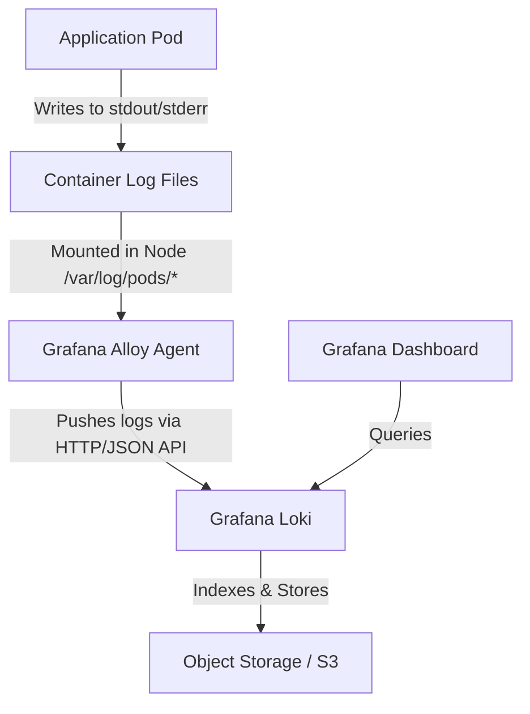

# Exercise 10: Loki Logging Failure Analysis

This document traces the EKS logging flow, diagnoses why logs have stopped appearing in Grafana, and identifies the exact failure point between Alloy and Loki.

## Log Pipeline Flow



---

## Failure Point Analysis

The error evidence:
* **Alloy Logs**: `failed to push logs... HTTP 403 (Forbidden)`
* **Loki Logs**: `authentication failed`

### 1. Where did the pipeline fail?
The failure occurs at the interface between **Alloy** and **Loki**. 
* The application successfully writes logs to stdout/stderr.
* Alloy successfully reads the log files from the node disk (since it is actively trying to push them).
* Grafana is healthy but has no logs because Loki is rejecting the push requests.
* **The direct failure point is the authentication validation layer in Loki when receiving requests from Alloy.**

---

### 2. Root Causes of HTTP 403/Authentication Failed

There are three common reasons for authentication failure between Alloy and Loki:

#### Cause A: Missing or Incorrect `X-Scope-OrgID` Header (Multi-Tenant Mode)
If Loki is running in multi-tenant mode (`auth_enabled: true` in the Loki config), it **requires** the `X-Scope-OrgID` HTTP header to identify which tenant the logs belong to.
- If Alloy sends logs without the `X-Scope-OrgID` header, Loki rejects the request with HTTP 401/403.
- If Alloy sends a tenant ID that is not configured or lacks permission, Loki returns HTTP 403.

#### Cause B: Expired or Incorrect Basic Auth Credentials
If Loki is fronted by an ingress or gateway (like NGINX, oauth2-proxy, or AWS Gateway) requiring Basic Authentication or a Bearer Token:
- The username or password configured in Alloy's `loki.write` block has changed or expired.
- The credentials in Kubernetes Secrets referenced by Alloy are stale.

#### Cause C: Network / Gateway Configuration Error
If the ingress controller routing to Loki has altered its security rules, or if it expects a Client Certificate (mTLS) that Alloy did not present.

---

## How to Investigate & Fix

### Step 1: Check Loki Multi-Tenancy Configuration
Inspect the Loki configuration file (`loki.yaml` or Helm values) to see if multi-tenancy is enabled:
```yaml
loki:
  auth_enabled: true  # Multi-tenant mode is active
```

### Step 2: Inspect Alloy Configuration
Examine the Alloy config file (`config.alloy`) in the `loki.write` block.
- **If Multi-Tenant (auth_enabled: true)**:
  Ensure Alloy is configured to send the `X-Scope-OrgID` header:
  ```alloy
  loki.write "local_loki" {
    endpoint {
      url = "http://loki.loki-stack.svc.cluster.local:3100/loki/api/v1/push"
      headers = {
        "X-Scope-OrgID" = "tenant-production",  # Must be present
      }
    }
  }
  ```
- **If Gateway Auth (Basic Auth)**:
  Ensure the credentials are correct and loaded dynamically from a Kubernetes Secret:
  ```alloy
  loki.write "local_loki" {
    endpoint {
      url = "http://loki-gateway.monitoring.svc.cluster.local/loki/api/v1/push"
      basic_auth {
        username = "alloy-writer"
        password = "my-secure-password" # Ensure this is up to date
      }
    }
  }
  ```

### Step 3: Apply and Validate
Apply the configuration updates:
```bash
kubectl apply -f alloy-configmap.yaml
kubectl rollout restart daemonset alloy -n monitoring
```
Verify the logs of Alloy:
```bash
kubectl logs -l app.kubernetes.io/name=alloy -n monitoring --tail=50
```
If successful, the `HTTP 403` errors will stop, and log metrics will start showing in Loki and Grafana.
