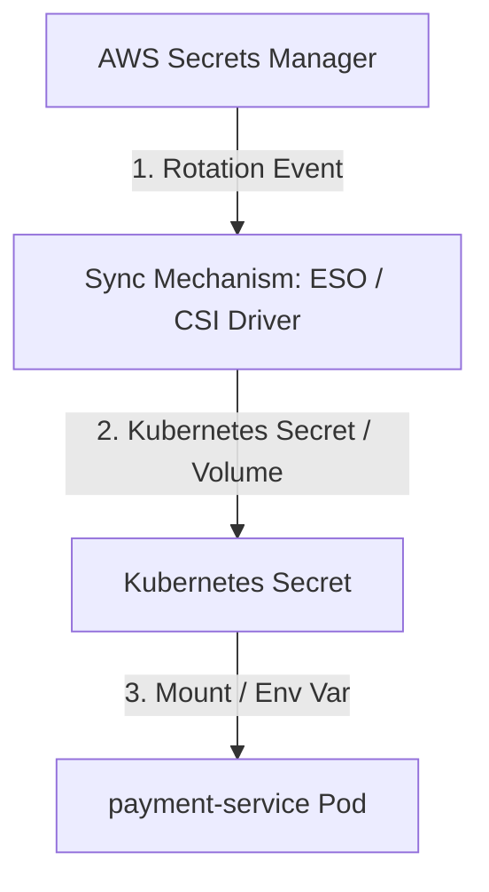

# Exercise 13: Secret Rotation Outage Analysis

This document explains why secret rotation in AWS Secrets Manager failed to propagate to the `payment-service` pod, leading to `401 Unauthorized` errors.

## Why Secret Rotation Did Not Propagate

When AWS Secrets Manager rotates a secret, it changes the value in the cloud. However, this change does **not** automatically push to Kubernetes resources or running containers. The lag in propagation is caused by a failure in one of the synchronization layers:



### 1. The Sync Mechanism is Static or Stale
Depending on how secrets are synchronized from AWS to Kubernetes, the following configurations block propagation:

#### Case A: External Secrets Operator (ESO)
* The `ExternalSecret` resource has a long `refreshInterval` (e.g. `24h` or default is large). If the rotation occurred at 08:55 but the last sync was 2 weeks ago, the operator will not poll for updates until the interval expires.
* Alternatively, the `external-secrets-controller` might be crashing, or its IAM role is failing to authenticate (similar to Exercise 4).

#### Case B: Secrets Store CSI Driver
* By default, the Secrets Store CSI Driver only retrieves the secret when a pod is **started**. 
* If **auto-rotation** is not explicitly enabled (`enableAutoRotation: true`), the mounted file on disk and any associated Kubernetes Secret created by the driver will **never** update for running pods.

---

### 2. The Application Does Not Hot-Reload Secrets (The Execution Gap)
Even if the Kubernetes Secret `payment-secret` is successfully updated, the running application pods will continue to use the **old** credentials if:
- **Secrets are mapped as Environment Variables**: Environment variables are static. Once a pod starts, its environment variables cannot be modified. The pod must be restarted to load the new values.
- **Secrets are read once at startup**: If the application reads the secret from a mounted volume file only during initialization, it will not detect updates to the file.

---

## Remediation & Prevention

### Immediate Fix
1. **Force Sync the External Secret**:
   If using ESO, force a manual sync:
   ```bash
   kubectl annotate externalsecret payment-db-secret force-sync=$(date +%s) --overwrite -n production
   ```
2. **Perform a Rolling Restart of the Pods**:
   Force the pods to restart, which re-injects the new secret values into the container environment variables:
   ```bash
   kubectl rollout restart deployment payment-service -n production
   ```

---

### Long-Term Prevention Strategies

#### Strategy 1: Install Stakater Reloader
Reloader is a Kubernetes controller that watches ConfigMaps and Secrets and performs rolling upgrades on associated Deployments when they change.

1. Install Reloader.
2. Add the annotation to the Deployment:
   ```yaml
   apiVersion: apps/v1
   kind: Deployment
   metadata:
     name: payment-service
     namespace: production
     annotations:
       reloader.stakater.com/auto: "true" # Watches all secrets mapped to this deployment
   spec:
     # ...
   ```
   Now, as soon as the sync operator updates the Kubernetes secret, Reloader will automatically restart the pods with zero downtime.

#### Strategy 2: Enable Auto-Rotation in Secrets Store CSI Driver
If using the CSI Driver, ensure auto-rotation is enabled in the Helm chart values:
```yaml
secrets-store-csi-driver:
  enableAutoRotation: true
  rotationPollInterval: 120s # Check for changes every 2 minutes
```

#### Strategy 3: Dynamic SDK Fetching (Best Practice)
Instead of syncing secrets to Kubernetes manifests, update the application code to use the AWS SDK with the **AWS Secrets Manager Caching Library** to fetch secrets directly from AWS. This guarantees that the application always retrieves the active secret version and handles rotation gracefully.
