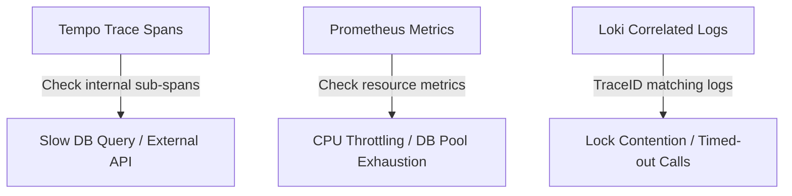

# Exercise 14: Distributed Tracing Investigation

This document analyzes the checkout latency bottleneck using distributed tracing (Tempo), metrics (Prometheus), and logs to pinpoint the root cause of the 4.8-second response time.

## 1. Tracing the Call Path (Tempo)
Distributed tracing allows us to see the latency breakdown across microservices for a single transaction.

```mermaid
gantt
    title Checkout Request Trace (Total: 4.8s)
    dateFormat  X
    axisFormat %s
    
    section Services
    checkout-service   :active, 0, 4.8
    inventory-service  :active, 0.2, 0.4
    payment-service    :active, 0.4, 4.6
```



### Trace Span Analysis
- **checkout-service**: Total execution time = **4.8s**
- **inventory-service**: Total execution time = **0.2s**
- **payment-service**: Total execution time = **4.2s** (Starts at `0.4s` and ends at `4.6s`)

The distributed trace shows that the bottleneck is within the **payment-service**, which accounts for **87.5%** of the total transaction latency.

---

## 2. Isolating the Bottleneck within `payment-service`

To determine why `payment-service` took 4.2 seconds, we must perform a deeper three-way correlation:



### Step 1: Sub-Span Inspection in Tempo
Drill down into the `payment-service` trace segment. Look for child spans that highlight specific operations:
* **Scenario A: Database Query Bottleneck**:
  A child span `db.query` executing `SELECT * FROM accounts WHERE id = ? FOR UPDATE` is taking **4.0s**. This points to:
  - Database row locking (lock contention).
  - A missing index on the table, forcing a full table scan.
* **Scenario B: External Gateway Latency**:
  A child span `http.outbound` targeting `api.stripe.com/v3/charges` takes **4.0s**. This indicates:
  - Slow response from the external payment processor.
  - Network egress congestion.
* **Scenario C: Thread Wait Time**:
  There are large empty gaps (no child spans) inside the 4.2s duration. This suggests:
  - The thread is blocked waiting for a resource (e.g., waiting to acquire a connection from the database pool).

---

### Step 2: Correlating with Prometheus Metrics
Cross-reference the trace timeframe with EKS container metrics:
- **CPU Throttling**:
  Check `container_cpu_cfs_throttled_seconds_total{container="payment-service"}`. If this value is rising rapidly, the container has hit its CPU limit, and Kubernetes is throttling the process, causing slow execution.
- **Connection Pool Exhaustion**:
  Check connection pool metrics (e.g. `hikari_db_connection_active` vs `hikari_db_connection_max`). If active connections are at max, requests will block waiting for a connection, introducing latency.

---

### Step 3: Checking Correlated Logs in Loki
Using Grafana, query Loki logs using the unique `trace_id` of the slow request:
```text
{container="payment-service"} |= "trace_id=1a2b3c4d5e6f"
```
Look for log patterns:
- `Slow query detected: SELECT... [duration: 4.12s]`
- `Failed to acquire database connection within timeout`
- `Stripe API connection timeout - retrying...`

---

## 3. Recommended Fixes
Depending on the exact child-span findings:
1. **If DB Lock / Slow Query**: Add database indexes on query filters (e.g., account IDs, checkout IDs), rewrite the query to avoid `FOR UPDATE` locking if possible, and optimize the DB connection pool size.
2. **If External API**: Implement a circuit breaker (e.g. using Resilience4j) and request timeouts (e.g., limit Stripe connection timeout to 2s) so the application fails fast or falls back gracefully rather than blocking the worker threads.
3. **If CPU Throttled**: Adjust the Helm chart resources spec:
   ```yaml
   resources:
     limits:
       cpu: "2"  # Increase CPU limit
     requests:
       cpu: "500m"
   ```
