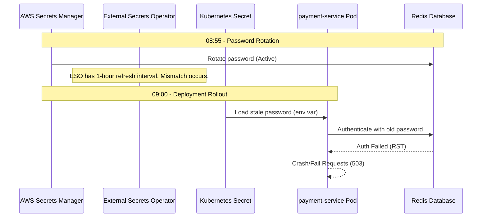

# Exercise 15: Complete Production Outage RCA

This document details the Root Cause Analysis (RCA) for the production outage that occurred on 2026-07-05 between 09:00 and 09:05.

## Incident Overview

- **Service Affected**: `payment-service`
- **Severity**: Critical (P1) - Complete Outage (HTTP 503)
- **Start Time**: 09:00
- **Resolve Time**: 09:15
- **Total Downtime**: 15 minutes

---

## Timeline of Events

| Time | Event | Description |
|---|---|---|
| **08:55** | AWS Secret Rotation | AWS Secrets Manager rotates the Redis authentication password. The Redis instance is updated with the new credential. |
| **09:00** | Deployment Completes | A Helm upgrade of `payment-service` completes. ArgoCD reports the application status as `Healthy` and sync as `Synced`. |
| **09:05** | Outage Detected | Ingress starts returning `HTTP 503` (Service Unavailable) to users. Automated alerts trigger. |
| **09:07** | Triaging Begins | Engineers inspect logs. Application pods report: `"Cannot connect to Redis"`. Redis logs show: `"Authentication failed"`. |
| **09:10** | Sync Verification | Kubernetes Secret `payment-secret` is inspected and found to contain the **old** password (last sync was 2 hours ago). |
| **09:12** | Action Taken | ExternalSecret is force-synced, and the Deployment is restarted. |
| **09:15** | Resolution | Pods connect successfully to Redis. Health checks pass, and HTTP 200 responses resume. |

---

## Root Cause Analysis (RCA)

The outage was caused by a synchronization lag between AWS Secrets Manager and EKS, coupled with a lack of dependency checking in the application readiness probes.



### 1. Secret Rotation Propagation Delay
AWS Secrets Manager rotated the Redis password at 08:55. The External Secrets Operator (ESO) was configured with a 1-hour `refreshInterval`, meaning it did not immediately fetch the new password. The Kubernetes Secret remained stale.

### 2. Stale Credentials Loaded at Startup
At 09:00, the new deployment rolled out. The new pods loaded the **stale** password from the un-synced Kubernetes Secret. Because they were starting fresh, they could not authenticate with Redis.

### 3. Faulty Readiness Probes (Why ArgoCD marked it "Healthy")
The `payment-service` deployment had a basic readiness probe that only checked if the HTTP port was open (e.g. TCP socket or basic ping). It did **not** verify that downstream dependencies (Redis) were reachable and authenticated. 
As a result:
1. Kubernetes marked the new pods as "Ready".
2. ArgoCD completed the rolling update, terminating the old pods (which had active cached connections or were functioning before the rollout).
3. The cluster was left with 100% of pods failing to authenticate with Redis, routing HTTP 503s to users.

---

## Mitigation & Prevention

### 1. Immediate Fix
1. **Force Sync the Secret**:
   ```bash
   kubectl annotate externalsecret redis-secret force-sync=$(date +%s) --overwrite -n production
   ```
2. **Restart the Application**:
   ```bash
   kubectl rollout restart deployment payment-service -n production
   ```

---

### 2. Long-Term Prevention

#### Fix A: Robust Readiness Probes (Dependency Checks)
Modify the application's readiness probe path `/healthz/ready` to verify connection to Redis and databases. If the connection fails, the probe returns HTTP 500, preventing the rolling update from completing.

```yaml
spec:
  containers:
    - name: payment-service
      readinessProbe:
        httpGet:
          path: /healthz/ready # Checks Redis connectivity
          port: 8080
        initialDelaySeconds: 10
        periodSeconds: 5
```

#### Fix B: Automated Rollout on Secret Update (Reloader)
Annotate the Deployment with **Stakater Reloader** to trigger an automatic rolling restart whenever the Kubernetes secret is updated.

```yaml
metadata:
  annotations:
    reloader.stakater.com/auto: "true"
```

#### Fix C: Sync Secret Rotation with EventBridge
Trigger an automated sync of External Secrets immediately following a Secrets Manager rotation using an AWS EventBridge rule that invokes an AWS Lambda function to run the Kubernetes sync API.

---

## Monitoring Improvements

1. **Alert on External Secret Failures**:
   Set up alerts for the metric `external_secrets_status_ready{status="false"}` to catch sync issues early.
2. **Alert on Redis Auth Failures**:
   Set up alerts for Prometheus scraping Redis:
   ```yaml
   alert: RedisAuthenticationFailures
   expr: rate(redis_rejected_connections_total[5m]) > 0
   ```
3. **Application 5xx Spike Alerts**:
   Set up a rate alert in Prometheus for HTTP 5xx responses:
   ```yaml
   alert: HighHTTP5xxRate
   expr: sum(rate(http_requests_total{status=~"5.."}[5m])) / sum(rate(http_requests_total[5m])) * 100 > 1
   ```
