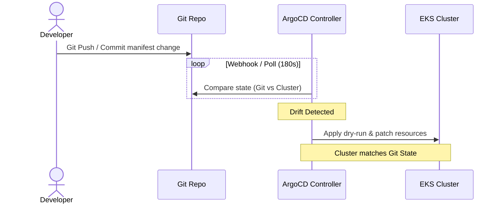

# Exercise 18: GitOps Platform Using ArgoCD

This repository structures a **GitOps platform** using ArgoCD to orchestrate continuous deployment across multiple EKS environments (`dev`, `qa`, and `prod`) based on state stored in Git.

## Directory Structure

```text
gitops/
├── dev/
│   └── payment-service-app.yaml   # ArgoCD Application for Dev (tracks 'dev' branch)
├── qa/
│   └── payment-service-app.yaml   # ArgoCD Application for QA (tracks 'qa' branch)
└── prod/
    └── payment-service-app.yaml   # ArgoCD Application for Prod (tracks 'main' branch)
```

---

## Technical Specifications

### 1. Automated Sync Policy
The platform implements automated state synchronization:
```yaml
syncPolicy:
  automated:
    prune: true        # Deletes resources in EKS that are removed from Git
    selfHeal: true     # Reverts manual 'kubectl' edits in the cluster
```
- **Pruning**: If an engineer deletes a ConfigMap or Service manifest from the Git repository, ArgoCD detects that the resource is missing in the source repository and deletes it from the EKS cluster.
- **Self-Healing**: If an engineer manually runs `kubectl edit deployment` or `kubectl delete service` directly on the cluster, ArgoCD detects the configuration drift and immediately overrides the manual change, restoring the cluster state to match Git.

### 2. Cascading Deletion (Finalizers)
To prevent orphaned resources when an entire ArgoCD application is deleted, we apply the `resources-finalizer.argocd.argoproj.io` finalizer. This guarantees that deleting the ArgoCD application resource will trigger the safe removal of all child resources (Deployments, Services, ConfigMaps) in EKS.

---

## GitOps Deployment Workflow



---

## Verification & Testing

### 1. Verify Application Deployment
Deploy the ArgoCD applications:
```bash
kubectl apply -f gitops/dev/payment-service-app.yaml
kubectl apply -f gitops/qa/payment-service-app.yaml
kubectl apply -f gitops/prod/payment-service-app.yaml
```

List deployed ArgoCD applications:
```bash
argocd app list
```
*Expected Output:*
```text
NAME                  STAGE      STATUS   HEALTH   STATUS
payment-service-dev   Synced     Healthy  Synced
payment-service-qa    Synced     Healthy  Synced
payment-service-prod  Synced     Healthy  Synced
```

### 2. Test Self-Healing (Manual Modification Drift)
Simulate drift by modifying the replica count of the production deployment:
```bash
kubectl scale deployment payment-service --replicas=10 -n production
```
1. Run `kubectl get deploy payment-service -n production`.
2. Within seconds, observe that ArgoCD detects the change, marks the app `OutOfSync`, and triggers **Self-Heal**.
3. The replica count is automatically scaled back to the git-defined state (e.g. 3).

### 3. Test Pruning (Resource Deletion)
1. Delete a configuration file (e.g., `configmap.yaml`) from the GitOps repository.
2. Commit and push the change to the `main` branch.
3. Run `kubectl get configmap -n production`.
4. Observe that ArgoCD has pruned (deleted) the ConfigMap from the EKS namespace.
