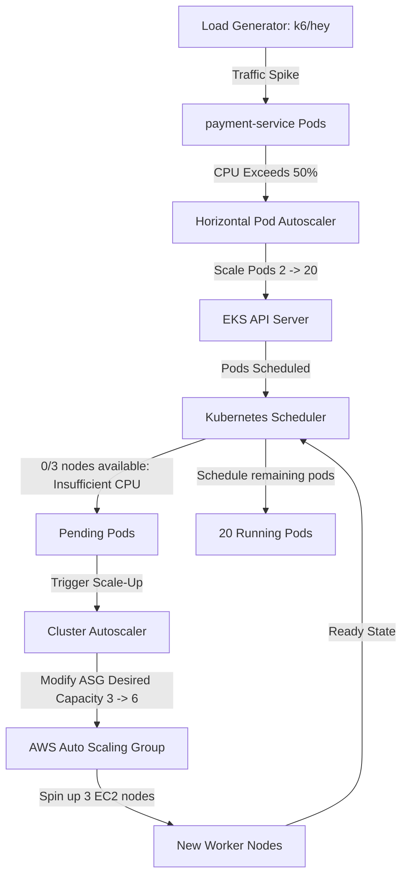

# Exercise 22: Horizontal and Cluster Autoscaling

This project implements automated scaling for an EKS workload across two distinct layers:
1. **Horizontal Pod Autoscaler (HPA)**: Dynamically scales the replica count of the application container based on CPU/Memory utilization thresholds.
2. **Cluster Autoscaler (CA)**: Dynamically provisions new EC2 worker nodes when existing nodes run out of CPU/Memory capacity to schedule pending pods.

## Directory Structure

```text
exercise-22/
├── hpa.yaml         # Horizontal Pod Autoscaler configuration
├── load-test.js     # k6 load testing script configuration
└── README.md        # Autoscaling explanation and verification guide
```

---

## Scaling Mechanics



---

## How to Deploy & Execute Load Test

### Step 1: Deploy the HPA
```bash
kubectl apply -f hpa.yaml -n production
```

### Step 2: Deploy the Target Workload
Ensure the deployment specifies resource requests (required for HPA calculation):
```yaml
spec:
  containers:
    - name: payment-service
      resources:
        requests:
          cpu: "250m"
          memory: "256Mi"
```

### Step 3: Run the Load Test
Execute the test using `k6` to simulate high traffic:
```bash
k6 run load-test.js
```

Alternatively, use the lightweight CLI tool `hey`:
```bash
# Run 100 concurrent requests, sending a total of 100,000 requests
hey -z 5m -c 100 https://app.example.com/api/v1/payments/process
```

---

## Verification & Outcomes

Monitor the scaling behavior in real-time.

### 1. Observe Pod Scale-Up (Expected: 2 -> 20)
Run the watch command on HPA:
```bash
kubectl get hpa payment-service-hpa -n production --watch
```
*Expected Output Progression:*
```text
NAME                  REFERENCE                    TARGETS   MINPODS   MAXPODS   REPLICAS   AGE
payment-service-hpa   Deployment/payment-service   25%/50%   2         20        2          5m
payment-service-hpa   Deployment/payment-service   85%/50%   2         20        6          6m
payment-service-hpa   Deployment/payment-service   120%/50%  2         20        15         7m
payment-service-hpa   Deployment/payment-service   95%/50%   2         20        20         8m
```

Verify the pod status:
```bash
kubectl get pods -n production -l app=payment-service
```
At peak, you will see 20 pods (some running, some temporarily pending).

### 2. Observe EKS Node Scale-Up (Expected: 3 -> 6)
Check the Cluster Autoscaler logs to verify ASG scaling events:
```bash
kubectl logs -f -n kube-system -l app=cluster-autoscaler
```
*Expected Log output:*
```text
I0705 21:35:00.123456       1 scale_up.go:345] Pod production/payment-service-xxxx is unschedulable due to Insufficient CPU
I0705 21:35:01.456789       1 scale_up.go:420] Triggering scale up of node group general-nodes from 3 to 6
I0705 21:35:05.987654       1 scale_up.go:500] Successfully updated ASG desired capacity to 6
```

Verify that the new EC2 nodes have joined the cluster successfully:
```bash
kubectl get nodes
```
The node list will scale from 3 to 6 healthy worker nodes.
Once the load test finishes, the HPA will cooldown for 5 minutes (`scaleDown.stabilizationWindowSeconds: 300`) and safely scale replicas back down to 2, followed by the Cluster Autoscaler terminating the idle nodes.
