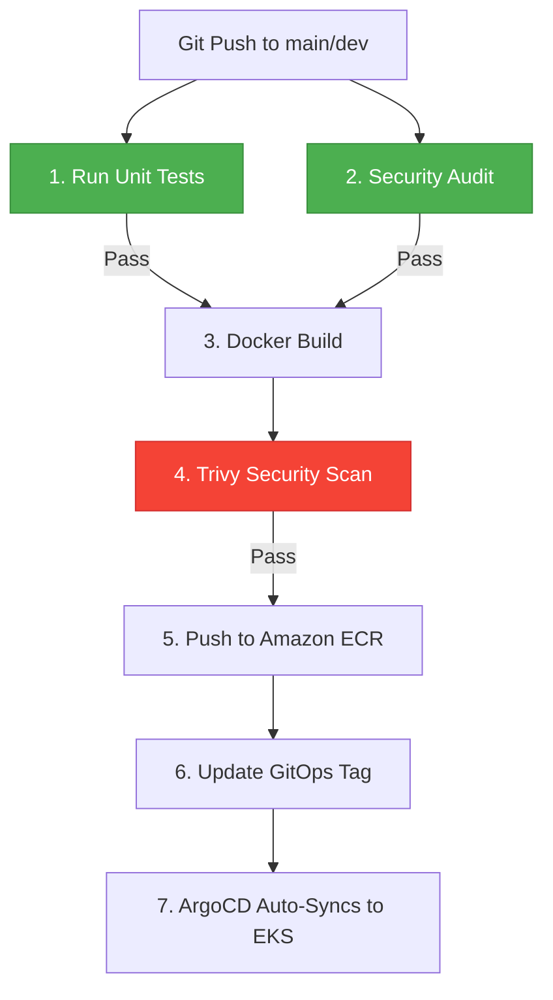

# Exercise 23: Build CI/CD Pipeline

This project defines a secure, production-grade **CI/CD Pipeline** using GitHub Actions that implements security gates, automated testing, container packaging, vulnerability auditing, and automated GitOps registry updates.

## Directory Structure

```text
exercise-23/
├── pipeline.yaml    # GitHub Actions workflow YAML configuration
└── README.md        # Pipeline explanation and gate validation guide
```

---

## Pipeline Workflow



---

## Quality & Security Gates (Failure Scenarios)

The pipeline is engineered to **fail fast** and halt delivery if any quality or security standard is breached:

### 1. Test Failures
- **Action**: Runs `npm test` or the appropriate test execution script.
- **Fail Condition**: If any unit/integration test fails, the runner returns a non-zero exit code, halting the pipeline. The Docker build and subsequent stages are skipped.

### 2. Dependency Vulnerabilities
- **Action**: Runs `npm audit` on the project package lock files.
- **Fail Condition**: If there are high or critical severity vulnerabilities in third-party library dependencies, the step fails.

### 3. Hardcoded Secrets (SAST Scan)
- **Action**: Uses **Trufflehog** to scan the commit diff for API keys, AWS credentials, database passwords, or private certificates.
- **Fail Condition**: If any credentials are found checked into the codebase, the scan fails immediately, protecting keys from leaking into version control logs.

### 4. Container Image Vulnerabilities
- **Action**: Scans the compiled container image using **Trivy** after the Docker build but before ECR push.
- **Fail Condition**: The scanner targets critical or high-severity vulnerabilities in base OS packages or application packages. Setting `--exit-code 1` forces the runner to abort if vulnerabilities are detected, preventing insecure images from reaching the registry.

---

## Execution & GitOps Integration

Once the security and test gates are passed, the pipeline:
1. Pushes the validated image to **Amazon ECR**.
2. Clones the separate **GitOps Config Repository** (`my-org/gitops-config`).
3. Uses `yq` to update the Helm image tag parameter (`.image.tag = "${{ github.sha }}"`) inside the chart values file.
4. Commits and pushes the change back to the GitOps repository.
5. **ArgoCD** detects the change in the GitOps config repository and performs an **Auto-Sync** rollout update on the target EKS namespace.
