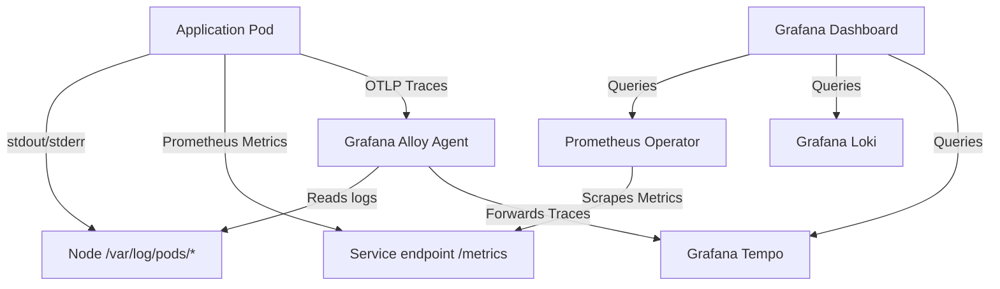

# Exercise 25: Observability Platform Deployment

This project deploys a comprehensive, production-grade observability platform on EKS using the **LGTM Stack** (Loki, Grafana, Tempo, Mimir/Prometheus) and **Grafana Alloy** as the telemetry collector.

## Directory Structure

```text
exercise-25/
├── prometheus-values.yaml   # Prometheus Operator & Grafana DataSource configuration
├── loki-values.yaml         # Log database filesystem configuration
├── tempo-values.yaml        # Distributed traces ingest receiver configuration
├── alloy-config.alloy       # Grafana Alloy pipeline mapping configuration
└── README.md                # Deployment guide and dashboard metric definitions
```

---

## Telemetry Collection Flow



- **Metrics**: Prom-Operator manages ServiceMonitors to scrape container endpoints.
- **Logs**: Alloy runs as a DaemonSet, scraping container logs from host directories and forwarding them to Loki.
- **Traces**: Alloy acts as an OpenTelemetry (OTLP) receiver, batching trace spans from the application SDK and pushing them to Tempo.

---

## Grafana Dashboard Metrics (PromQL & LogQL)

To fulfill the dashboard requirements, the following queries are configured in Grafana:

### 1. CPU Utilization (Percentage)
Calculates container CPU core usage relative to the pod's configured CPU limits:
```promql
(sum(rate(container_cpu_usage_seconds_total{container="payment-service", namespace="production"}[5m])) / 
 sum(kube_pod_container_resource_limits{resource="cpu", container="payment-service", namespace="production"})) * 100
```

### 2. Memory Utilization (Percentage)
Calculates active container memory usage relative to the pod's memory limits:
```promql
(sum(container_memory_working_set_bytes{container="payment-service", namespace="production"}) / 
 sum(kube_pod_container_resource_limits{resource="memory", container="payment-service", namespace="production"})) * 100
```

### 3. Request Rate (throughput - Queries Per Second)
Measures incoming query volume processed by the service:
```promql
sum(rate(http_requests_total{container="payment-service", namespace="production"}[5m]))
```

### 4. Error Rate (Percentage)
Tracks HTTP 5xx errors as a percentage of total traffic to trigger alerts:
```promql
(sum(rate(http_requests_total{status=~"5..", container="payment-service", namespace="production"}[5m])) / 
 sum(rate(http_requests_total{container="payment-service", namespace="production"}[5m]))) * 100
```

---

## Installation Guide

### Step 1: Create Namespace
Create the monitoring boundary:
```bash
kubectl create namespace monitoring
```

### Step 2: Install Prometheus & Grafana (Kube-Prometheus-Stack)
```bash
helm repo add prometheus-community https://prometheus-community.github.io/helm-charts
helm repo update
helm install prometheus-stack prometheus-community/kube-prometheus-stack \
  -f prometheus-values.yaml \
  --namespace monitoring
```

### Step 3: Install Loki
```bash
helm repo add grafana https://grafana.github.io/helm-charts
helm install loki grafana/loki \
  -f loki-values.yaml \
  --namespace monitoring
```

### Step 4: Install Tempo
```bash
helm install tempo grafana/tempo \
  -f tempo-values.yaml \
  --namespace monitoring
```

### Step 5: Install Alloy
Apply the configuration Map and install the collector:
```bash
kubectl create configmap alloy-config --from-file=config.alloy=alloy-config.alloy -n monitoring
helm install alloy grafana/alloy --namespace monitoring
```
Verify the telemetry pipeline is active in Grafana dashboard datasources.
